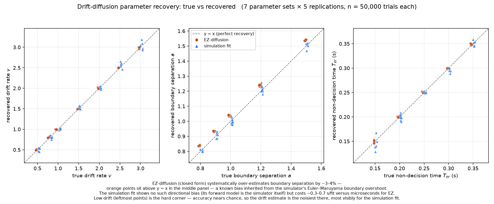
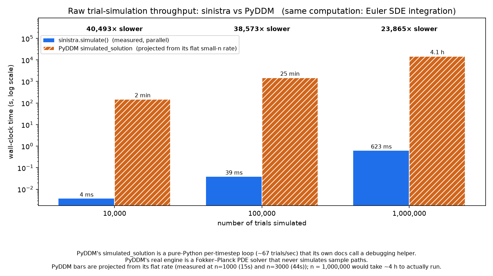
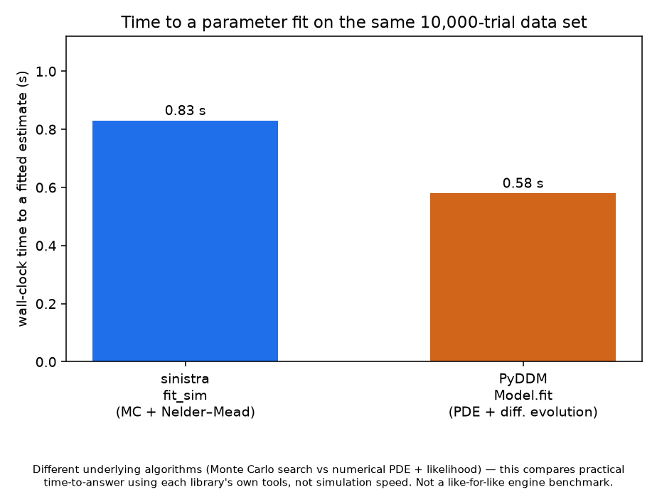
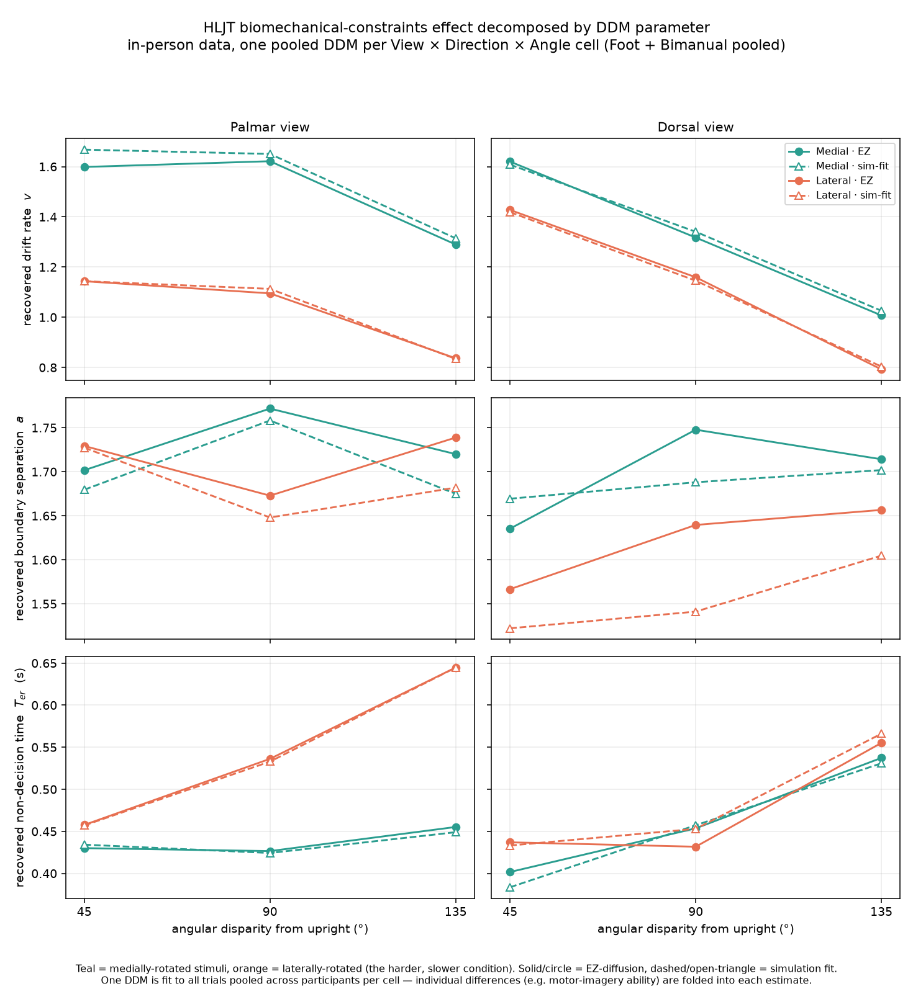

# sinistra

**Simulate the drift-diffusion model and recover its parameters — closed-form
and by brute-force simulation — in Rust, with Python bindings.**

I have never been able to tell left from right without a beat of conscious
effort. The *hand laterality judgement task* — shown a rotated hand, decide
whether it's a left or a right — is one of the ways cognitive scientists put a
number on exactly that kind of covert mental work, and a real dataset from it
is what this project ends up analysing. `sinistra` is the Latin word for
"left."

## What it is

`sinistra` implements the **drift-diffusion model** (DDM), the standard
account of fast two-alternative decisions: evidence accumulates noisily from a
starting point until it reaches one of two boundaries. Each trial is an
Euler–Maruyama integration of `dx = drift_rate·dt + noise_sd·√dt·N(0,1)`;
`non_decision_time` is added to the crossing time to give the response time.

It recovers the model's parameters from choice + response-time data **two
independent ways**:

- **EZ-diffusion** (Wagenmakers, van der Maas & Grasman, 2007) — a closed-form
  inversion of three summary statistics. Microseconds, but relies on
  approximating assumptions.
- **Simulation-based fitting** — a Nelder–Mead search that re-simulates the
  model at each candidate and matches its `(accuracy, mean RT, RT variance)` to
  the data's. Sub-second, and makes no closed-form approximation because the
  forward model *is* the simulator.

The core is Rust — trial simulation runs across all cores and is
bit-reproducible for a given seed. There's a `sinistra` CLI and a NumPy-based
Python module.

**Status:** published — `pip install sinistra` (Python) and
`cargo add sinistra-core` / `cargo install sinistra-cli` (Rust). See
[Quickstart](#quickstart).

## Key results

### Core throughput — ~1.52M trials/sec

`simulate_n` parallelises trials with rayon and stays deterministic given a
seed (each trial draws from its own ChaCha8 cipher stream, independent of
thread count). The criterion benchmark
([`core/benches/simulate.rs`](core/benches/simulate.rs), `cargo bench -p
sinistra-core`) measures **~1.52M trials/sec at n = 1,000,000**. The Python
`simulate()` reaches the same figure — the NumPy-array boundary adds no
measurable marshalling overhead at scale.

### Parameter recovery — the two estimators agree, and EZ's bias is visible



Seven true parameter sets × five replications at n = 50,000, recovered by both
methods. They track each other closely across drift rate, boundary separation
and non-decision time. The one systematic difference: **EZ over-estimates
boundary separation by ~3–4%** — a discretization artifact it inherits from
the simulator's finite `dt` — which the simulation fit does not have (orange
points sitting above the diagonal in the middle panel). The tolerances and
their first-principles derivation live in the test doc comments in
[`core/src/lib.rs`](core/src/lib.rs)
(`ez_diffusion_recovers_known_parameters`,
`fit_simulation_recovers_known_parameters`).

### vs PyDDM — far faster at raw simulation, roughly at parity on time-to-a-fit



PyDDM does ship a genuine trial-by-trial simulator, but its docs call it a
debugging helper — PyDDM's real engine is a Fokker–Planck PDE solver that never
simulates paths. Against that trial simulator, `sinistra` is
**~24,000–40,000× faster** at generating raw trials.



For what people actually do — reach a parameter estimate — it's roughly a
wash: `sinistra.fit_sim` ≈ 0.8 s vs PyDDM's `Model.fit` ≈ 0.6 s on the same
10,000-trial data set, using different algorithms (Monte-Carlo search vs
PDE + likelihood). Fairness notes and the full method are in
[`py/benchmarks/README.md`](py/benchmarks/README.md). This is a dev-only
comparison; PyDDM is not a dependency.

### Real data — the biomechanical-constraints effect is a *drift-rate* effect



Fitting a DDM to each design cell of a real, public hand-laterality dataset:
laterally-rotated hand stimuli (anatomically harder to imagine moving) are
judged ~6 percentage points less accurately and ~90 ms slower than
medially-rotated ones. Decomposed, that difference is **almost entirely a drop
in drift rate (~−24%)** — not a change in the decision boundary (~−3%, and not
robust across method or view) or in non-decision time (~+60 ms, a secondary
effect). EZ and the simulation fit agree.

Caveat: one DDM is fit per cell to trials **pooled across all participants**,
not a hierarchical per-subject model — individual differences (e.g.
motor-imagery ability) are folded into each aggregate estimate. Fine for a
"which parameter moves" question; see
[`py/examples/hljt_analysis.py`](py/examples/hljt_analysis.py).

## Quickstart

### CLI

```sh
cargo install sinistra-cli

# Simulate 10k trials -> CSV with columns: choice (upper|lower), rt (seconds)
sinistra simulate \
  --drift 1.2 --boundary 1.0 --start 0.5 --t0 0.3 \
  --n 10000 --seed 42 --out trials.csv

# Recover parameters — closed form (near-instant)
sinistra fit-ez --input trials.csv

# Recover parameters — simulation search, warm-started from the EZ estimate
sinistra fit-sim --input trials.csv --max-iters 150
```

`simulate` writes only completed trials; any that hit the 10 s cap are dropped
and the count is reported on stderr.

### Rust library

```sh
cargo add sinistra-core
```

```rust
use sinistra_core::{Params, simulate_n, ez_diffusion};

let trials = simulate_n(&Params::new(1.2, 1.0, 0.5, 0.25), 100_000, 42);
let est = ez_diffusion(&trials).unwrap();
```

### Python

```sh
pip install sinistra
```

```python
import sinistra

choices, rts, n_excluded = sinistra.simulate(
    drift=1.2, boundary=1.0, start=0.5, t0=0.25, n=1_000_000, seed=42
)
# choices: np.ndarray[bool]     (True == upper boundary)
# rts:     np.ndarray[float64]  (seconds)

ez  = sinistra.fit_ez(choices, rts)                    # -> dict
sim = sinistra.fit_sim(choices, rts, initial_guess=ez) # -> dict + iterations, final_cost
```

Parameter dicts use the keys `drift_rate`, `boundary_separation`,
`starting_point`, `non_decision_time`, `noise_sd`. Unfittable data raises
`sinistra.SinistraError`. See [`py/README.md`](py/README.md) for more.

### Tests and benchmarks

```sh
cargo test --all      # profile.test is opt-level 3 — the suite runs millions of MC trials
cargo clippy --all-targets -- -D warnings
cargo bench -p sinistra-core
```

## Workspace layout

| crate  | kind                 | contents |
| ------ | -------------------- | -------- |
| `core` | library              | the model and both estimators: `Params`, `Trial`, `simulate_trial`, `simulate_n`, `summary_stats`, `ez_diffusion`, `fit_simulation`, `default_fit_guess` |
| `cli`  | binary (`sinistra`)  | thin CSV wrapper — `simulate`, `fit-ez`, `fit-sim` |
| `py`   | cdylib               | PyO3 + rust-numpy bindings (`import sinistra`), built with maturin |

Analysis scripts and their figures live in `py/examples/` and
`py/benchmarks/`; the HLJT dataset is vendored under `data/hljt/`.

## Data attribution

The dataset in `data/hljt/` (used only by the Phase 7 analysis):

> Moreno-Verdú M, McAteer SM, Waltzing BM, Van Caenegem E, Hardwick RM (2025).
> Development and validation of an open-source Hand Laterality Judgement Task
> for in-person and online studies. Neuroscience.
> https://doi.org/10.1016/j.neuroscience.2025.02.056
> Data from OSF project https://osf.io/8h7ec/, licensed CC BY 4.0.

## License

`sinistra`'s own code is MIT — see [LICENSE](LICENSE). The vendored HLJT data
is CC BY 4.0 (cited above).

## Known limitations & future directions

- **No hierarchical fitting.** Both estimators fit a single DDM to a flat pool
  of trials. A per-subject / hierarchical model is the natural next step,
  especially for data with real individual variation.
- **One real dataset so far.** The HLJT analysis is a proof of concept; more
  public choice-RT datasets would exercise the tooling harder.
- **A fixed model.** `starting_point` and `noise_sd` are held at `0.5` and
  `1.0` rather than fitted, and across-trial parameter variability isn't
  modelled.

